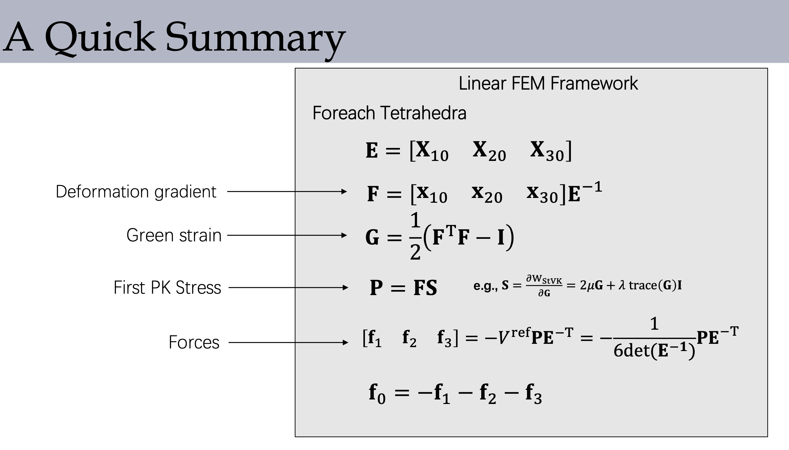

# 数学公式推导以及部分代码思路

## 1. 3D StVK 能量模型

StVK 模型的能量密度（单位体积内的能量）为

$$
W(G) = \frac{\lambda}{2}(Tr(G))^2 + \mu Tr(G^2)
$$

其中 $G=\frac{1}{2}(F^{T}F-I)$ 为 Green 应变张量。

## 2. Second Pialo-Kirchhoff 应力

$$
S = \frac{\partial{W}}{\partial{G}} = \lambda Tr(G)I + 2\mu G
$$

## 3. Lame 常数$\lambda$,$\mu$与杨氏模量$E$、泊松比$\nu$的关系

$$
\lambda = \frac{E\nu}{(1+\nu)(1-2\nu)}
$$

$$
\mu = \frac{E}{2(1+\nu)}
$$

在软体模拟中，推荐参数 $E=20000Pa$ , $\nu=0.2$, $\rho=400kg/m^3$, $g=0.05m/s^2$, $Size = 8m*2m*2m$，对应$\lambda = 5555.6 Pa$，$\mu=8333.3Pa$

## 4. 采用了约去体积的操作

显示欧拉时间积分：

$$
x(t_{n+1}) = x(t_n) + (v(t_n) + \frac{1}{m}f(t_n)\Delta t)\Delta t
$$

对于一个确定的顶点，质量和力按与其 Adjacent 的所有四面体 Tritrahedrons 的 Reference Volumn 求和，用 index t 代表相邻的所有四面体：

$$
m = \frac{1}{4}\sum_{t}\rho_t{V^{ref}_t}
$$

$$
f = \sum_{t}{Some Linear Operation(V^{ref}_tP_tE^{-T}_t)}
$$

只出现力和速度的比值（加速度）。对于 Reference State 均匀划分的四面体（每个四面体体积相等），消去$V^{ref}_t$：

$$
m = \frac{1}{4}\sum_{t}\rho_t
$$

$$
f = \sum_{t}{Some Linear Operation(P_tE^{-T}_t)}
$$

此外，如果密度也是常数（均匀介质），则可以把密度除在杨氏模量的分母上。质量可以直接取为

$$
m = \frac{1}{4}Numers\space of\space Tetrahedrons\space Adjacent
$$

但是由于我们的划分方法是用的“沿着立方体对角线(0,0,0)和(1,1,1)，再在其余四个顶点中选择两个组成四面体”的划分方法，这种方法每个顶点连接着的四面体个数并不均匀，为了 specify 这个相接四面体数，可以这么做：

在初始化阶段，遍历所有四面体，每个四面体存有指向其四个顶点的指针，通过这个指针获取顶点的 Index，顶点每出现一次，就把这个 Number 加一。这样遍历完四面体，就实现了“既不重复，也不缺少”地数清了每个顶点相接的四面体数量。

比如(0,0,0)位置的顶点的质量$m$应该是$\frac{6}{4}$。

约去体积$V^{ref}$的操作不是必须的。采用了这个操作需要注意，虽然每个顶点的质量分布不均匀了，但是在计算力时，质量小（相接四面体数量少）的顶点的力的求和中也会少一些 terms，最终效果是等价的。

初始化阶段结束后，每个顶点的质量数据就不变了。

## 5.显示积分法的 CFL 条件

弹性体的波速

$$
c = \sqrt{\frac{E}{\rho}} \approx7.07 \space\text{m}/\text{s}
$$

CFL 条件

$$
\Delta t < C\frac{\Delta h}{c}
$$

为了清楚分辨系统特征，取$\Delta h \sim \frac{1}{10}L \sim 0.2 \space \text{m}$，要求$\Delta t < C\cdot0.28 \space \text{s}$，OpenGL 的帧率大概是 0.02s，取 2 ～ 3 个子时间步长就能保证这一条件被满足。

至于为什么重力加速度$g$不能过大，原因是这样的。连续体的速度$u$如果接近声速$c$，那么连续体的 incompressibility 就会 break down，会产生较为激烈的形变，linear deformation 方法就不再适用了。

通过键盘交互施加力时也可以看出这一点。如果力过大使得弹性体的速度过快，弹性体也会严重偏离 reference state 的形状。

## 6.Algorithm Framework

## 7.调试方式：

按 H、J、K、L 可以给弹性体右端面施加 x、y 方向的垂直/剪切力。

实现了 3 种渲染方式：1.只渲染表面。2.只渲染四面体的棱边。3.渲染顶点，并用速度大小作为颜色映射。
